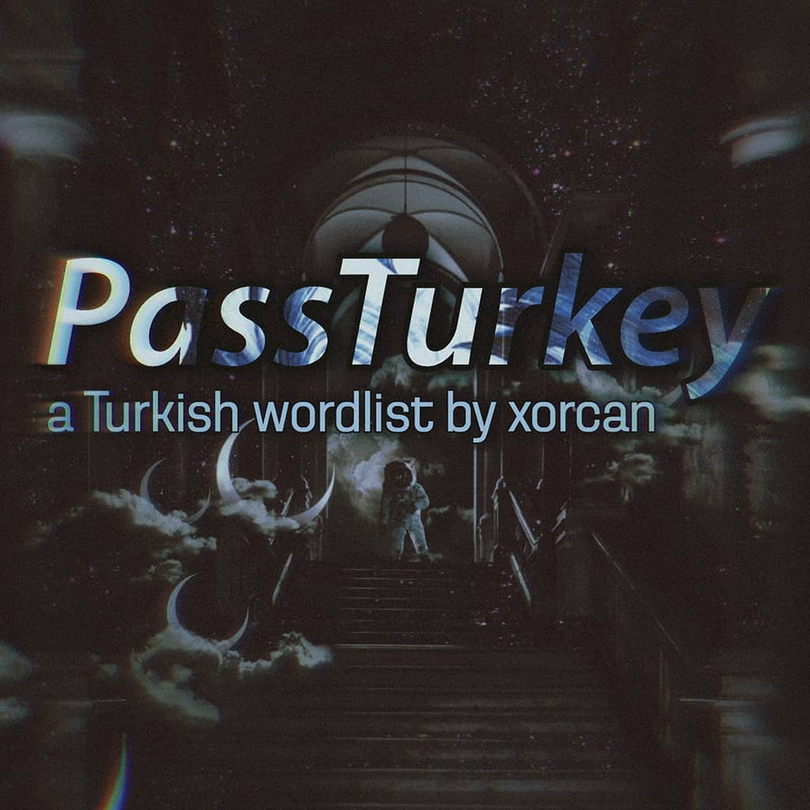

<h2 align="center"> 
<b>PassTurkey, a Turkish Wordlist, Türk Parola Listesi</b></h2><h4 align="center">Güvenlik için kullanılması münasiptir.</h4>

    
a wordlist for mostly Turk websites.

## Kullanım

İlk 10 satırı silip kullanabilirsiniz. Liste çoğunlukla Türk sitelerinde bulunan parolalardan alıntıdır. Güvenlik amacıyla kullanılmasını temenni ediyorum.

## Bildir

Eklenmesini uygun gördüğünüz şeyleri çekinmeden [Hatalar](https://github.com/xorcan/passturkey/issues) kısmından bildirin.

## Uyarı

Bu makaledeki uygulamaların gizlilik sözleşmelerini okuyunuz. Eğer ne yaptığınızı bilmiyorsanız bu işlemlerden uzak durun. Her cihazın yapısı farklıdır, oluşabilecek sorunlardan makale editörü sorumlu tutulamaz.

## Lisans

  

Tüm sorumluluk kullanıcıya aittir. Kullanabilir, çalışabilir ve paylaşmayı istediğiniz gibi geliştirebilirsiniz. Özellikle, Özgür Yazılım Vakfı tarafından yayımlanan [GNU Genel Kamu Lisansı](https://www.gnu.org/licenses/gpl.html) koşulları altında, lisansın 3. sürümü veya daha sonraki sürümlerinde yeniden dağıtabilir ve/veya değiştirebilirsiniz.